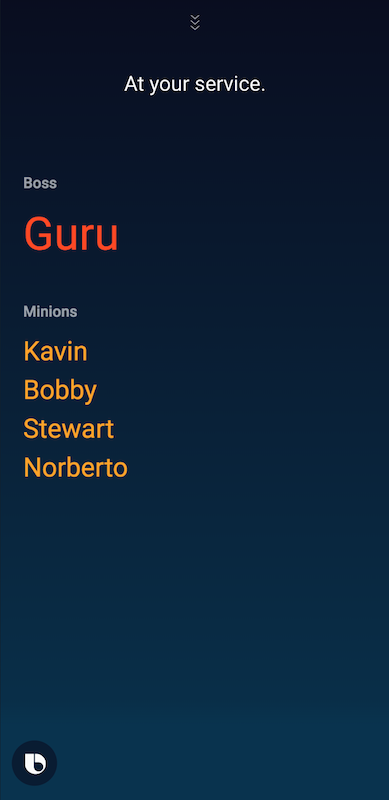

  
   
  <h1 align="Center">Bixby User Data Persistence Sample Capsule</h1>

## Overview

This is an example capsule that demonstrates how to persist user data across conversations by performing CRUD operations on a remote database.

The scenario for this capsule is to allow each user to manage an "army". The user data is the army and consists of a single `Boss` Concept and any number of `Minion` Concepts.

### Capsule Usage

#### READ

This will get the user data if it exists, otherwise there will be no results. `nl("Summon my army")`

#### CREATE/UPDATE

This will update the user data if it exists, otherwise it will create it. We demonstrate 2 types of persistence:
- A property with a single state that gets replaced with any incoming value. `nl("Crown Guru as the big boss")`
- A property with multiple values that get appended with any incoming value(s). `nl("Enlist Kavin, Bobby and Stewart")` followed by `nl("Conscript Norberto")` will result in an army of 4 minions.

#### DELETE

This will delete the user data. `nl("Disband my army")`

### Setup Instructions

#### Remote Database Setup

We are using restDB, a service which allows developers to create a cloud hosted noSQL database exposed through a REST API.
To create your own remote database, follow these simple steps:

- Sign up for a free restDB account at https://restdb.io/
- [Create a new Database](https://restdb.io/account/databases/) called `bixby`. Click on the database to go to its home page. Example: https://bixby-25e7.restdb.io/home/ 
- Click on the top right icon with 3 gears to enter Developer Mode. Add a new Collection called `<your-capsule-name>`. Example: `example-user-data` 
- Click on the new Collection to configure its Fields.
  - Add Field for user id of type Text with Requirements Required and Unique. Example: `bixby-user-id` 
  - Add Field for user data of type json with Requirements Required and Unique. Example: `bixby-user-data` 
- That's it! Your setup should now look like this. Next you will connect and authenticate to it from the capsule. 

#### Dynamic Properties Setup

Since this capsule is in the `example` namespace, it doesn't use [dynamic configs & secrets](https://bixbydevelopers.com/dev/docs/reference/ref-topics/capsule-config).

To setup with a real namespace and keep your data secure:
- [Register your Team and Capsule](https://bixbydevelopers.com/dev/docs/dev-guide/developers/managing-caps.managing-your-team) in the Bixby Developer Center
- [Add configs & secrets](https://bixbydevelopers.com/dev/docs/reference/ref-topics/capsule-config#config-secrets) in the Bixby Developer Center as follows:
  - Configs:
    - `baseUrl`=`https://bixby-25e7.restdb.io/rest/`: Update this to match the url provided at the top of your Collection Developer Tools panel, but without the collection name which we add separately on next step
    - `collection`=`example-user-data`: Collection name from above
    - `userIdField`=`bixby-user-id`: User id field from above
    - `userDataField`=`bixby-user-data`: User data field from above
  - Secrets:
    - `apiKey`=`678b16ce31cfef34e796dcefd81ea27072574`: Update this to match the Server apiKey provided in your Database Settings
  - Hit the Save button. Now your Configs & Secrets should look like this: 
- Edit the capsule.bxb file to update the [`id` key](https://bixbydevelopers.com/dev/docs/reference/type/capsule.id) to match your registered capsule namespace and name 
- Edit the capsule.properties file to change the `capsule.config.mode` from `example` to `default` 

That's it! Now you can sync your capsule and try out some queries!

**Note:** You may want to repeat the setup instructions twice to have a Dev and a Prod environment.

### Limitations

This is intended for non-sensitive user data.

---

## Additional Resources

### Your Source for Everything Bixby
* [Bixby Developer Center](http://bixbydevelopers.com) - Everything you need to get started with Bixby Development!

### Guides & Best Practices
* [Quick Start Guide](https://bixbydevelopers.com/dev/docs/get-started/quick-start) - Build your first capsule
* [Design Guides](https://bixbydevelopers.com/dev/docs/dev-guide/design-guides) - Best practices for designing your capsules
* [Developer Guides](https://bixbydevelopers.com/dev/docs/dev-guide/developers) - Guides that take you from design and modeling all the way through deployment of your capsules

### Video Guides
* [Introduction to Bixby](https://youtu.be/DFvpK4PosvI) - Bixby and the New Exponential Frontier of Intelligent Assistants
* [Bixby Fundamentals](https://bixby.developer.samsung.com/newsroom/en-us/22/01/2019/Teaching-Bixby-Fundamentals-What-You-Need-to-Know) - Bixby Fundamentals: What You Need to Know

### Need Support?
* Have a feature request? Please suggest it in our [Support Community](https://support.bixbydevelopers.com/hc/en-us/community/topics/360000183273-Feature-Requests) to help us prioritize.
* Have a technical question? Ask on [Stack Overflow](https://stackoverflow.com/questions/tagged/bixby) with tag “bixby”
