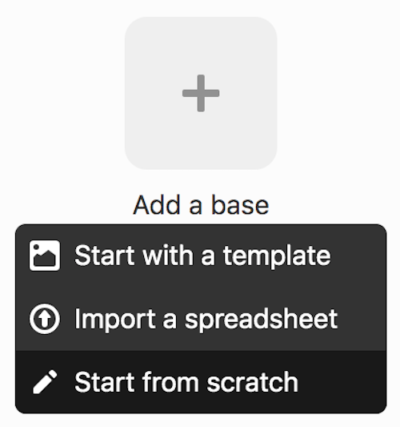
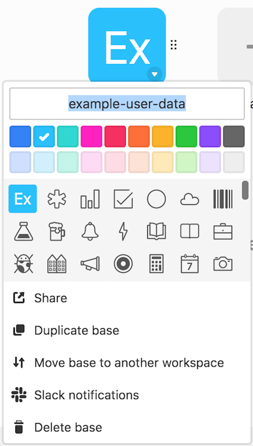

# Airtable

Airtable is a service which allows developers to create a cloud hosted spreadsheet exposed through a REST API.

#### Remote Database Setup

- Sign up for a free Airtable account at https://airtable.com/
- Create a new Workspace called `bixby`.
- "Add a base" > "Start from scratch". Change title to `<your-capsule-name>`. Example: `example-user-data`

  

  

- Click on the new Base to configure the table
  - The first column is the required and unique [primary field](https://support.airtable.com/hc/en-us/articles/202624179-The-Name-Field) that we will use for the bixby user ids. Click on the header dropdown arrow to edit it. Leave the default type unchanged (Single line text) and rename the field. Example: `bixby-user-id`
  - Edit the second column to hold the bixby user data. Customize the field type to "Long text" and rename it. Example: `bixby-user-data`
  - Delete any other columns
  - Delete all row records
- That's it! Your setup should now look like this . Next you will connect and authenticate to it from the capsule. 

#### Dynamic Properties Setup

Follow the instructions in the [main README](./README.md) and insert the following values when requested.

- Configs:
  - `service`=`airtable.js`
  - `baseUrl`=`https://api.airtable.com/v0/appj3vi1PtX4Q9CqP/Table%201`: Update this to match the url provided in the docs for your new Workspace and Base at https://airtable.com/api.
  - `userIdField`=`bixby-user-id`: User id field from above
  - `userDataField`=`bixby-user-data`: User data field from above
- Secrets:
  - `apiKey`=`keypIplWmQs8liVl1`: Update this to match the api key from your account page > API > "Generate API key"
